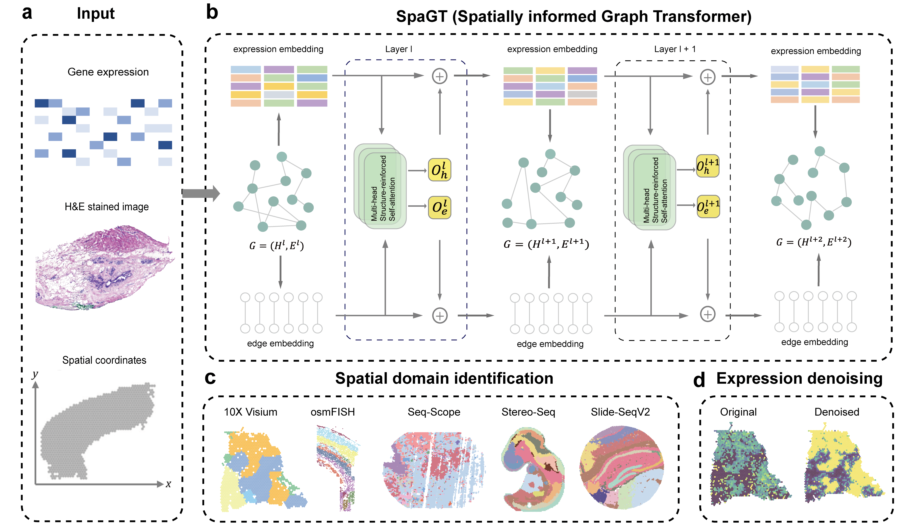

SpaGT - Spatialyinformed Graph Transformer
=============================================================================

.. toctree::
   :maxdepth: 2
   :caption: Contents:

   Installation
   run_dlpfc
   run_cl
   run_cl_denoising

Introduction
========
Here, we present a novel graph transformer framework, SpaGT (Spatially informed Graph Transformer), which employs both expression and relational channels to model spatially aware graph representations.This approach enhances the denoising of gene expression data and facilitates the precise identification of spatial domains.Unlike traditional static localized convolutional aggregation, SpaGT leverages a structure-reinforced self-attention mechanism that iteratively evolves the structural information and transcriptional signal representation.Notably, SpaGT replaces graph convolution with global self-attention, thereby enabling the effective integration of global and spatially localized information, which enhances the detection of fine-grained spatial domains.

